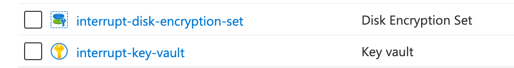
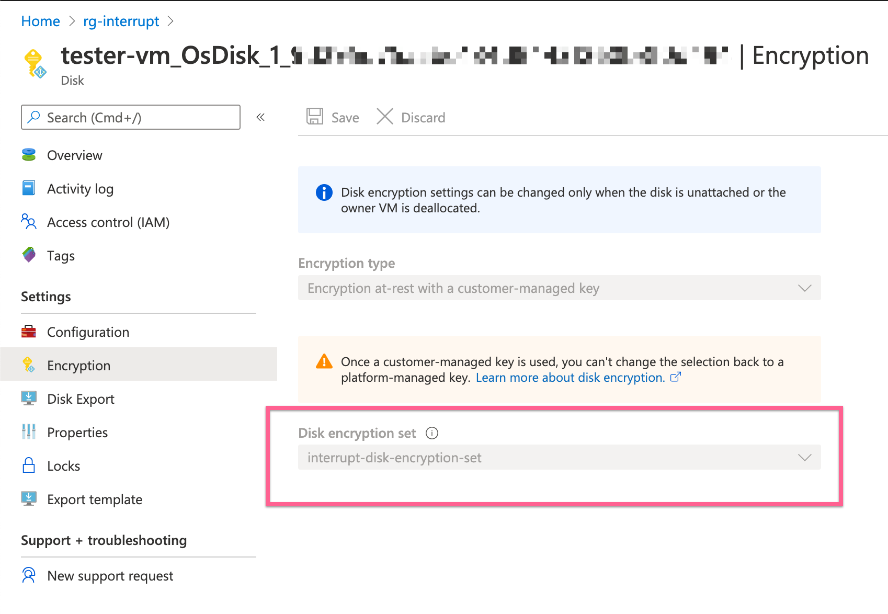
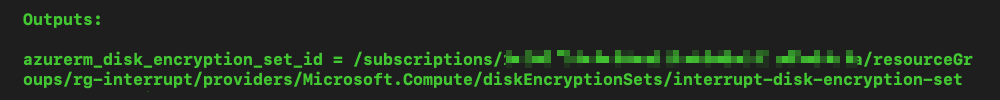

# Azure Virtual Machine
This repository contains a sample Terraform configuration to create an Azure Virtual Machine resource. This example assumes that the purpose of the virtual machine is to prepare a functional Terraform server with an Ubuntu operating system. However, the ultimate intent is to change the properties of this generic item to fit more complex scenarios.

## About this example

* Clone this repository to your local machine.
* Modify the final properties of the target environment by making changes in the contents of `terraform.tfvars`. Making changes there supercedes the default changes in `variables.tf`.
* Make it your own

### Azure Security Credentials

To use this configuration, you require appropriate identity credentials to access your Azure environment. More specifically, the following:

```
ARM_SUBSCRIPTION_ID
ARM_CLIENT_SECRET
ARM_TENANT_ID
ARM_CLIENT_ID
```
These should be expressed as environment variables in your local machine and the variables must be available at the time of a Terraform Apply run.

### Using SSE/CMK Keys as Disk Encryption Sets

We configure the Azure Key Vault service for Server-side encryption (SSE) for the Azure Managed Disk in this config. The procedured can be procured using the Terraform provider [`azurerm_disk_encryption_set`](https://www.terraform.io/docs/providers/azurerm/r/disk_encryption_set.html).

In this example, however, the work is done manually by creating a dedicate Azure Key Vault (AKV) with a generic key, and we associate the AKV service to a Disk Encryption Set.



Since the resource group already exists, we do not create a new resource but reference it as a standard for the config.

```
data "azurerm_resource_group" "azvm" {
  name = "rg-interrupt"
}
```

In our basic configuration we include the reference to the disk encryption set in `main.tf` as follows:

```
data "azurerm_disk_encryption_set" "azdes" {
  name                = "interrupt-disk-encryption-set"
  resource_group_name = data.azurerm_resource_group.azvm.name
}
```

We then reference the disk encryption set id under the `azurerm_linux_virtual_machine` resource stanza as follows:

```
  os_disk {
    caching                = "ReadWrite"
    storage_account_type   = "Standard_LRS"
    disk_size_gb           = "60"
    disk_encryption_set_id = data.azurerm_disk_encryption_set.azdes.id
  }
```

Once the `terraform apply` stage is completed, we examine the association for the new disk (attached to the new VM) and confirm that it is using the desired disk encryption set and keys.



From the `outputs.tf` the most meaningful tag that can be obtained is the ID of the Disk Encryption Set.

```
output "azurerm_disk_encryption_set_id" {
  value = data.azurerm_disk_encryption_set.azdes.id
}
```



### SSH connectivity

Additionally, we assume that remote connectivity to the virtual machine is allowed. In this example, we make an assumption of a local, hidden `ssh` directory which holds a SSH public key.

```
  admin_ssh_key {
    username   = "tfadmin"
    public_key = file("./.ssh/id_rsa.pub")
  }
```

When you are testing, we recommend the following sequence in your working directory, on your local machine:

```
mkdir .ssh
ssh-keygen -f .ssh/id_rsa
```

The `ssh-keygen` command produces your private and public keys: `id_rsa` and `id_rsa.pub`. You use those to connect to your virtual machine. For instance, assume that your new virtual machine is publically available at `40.86.209.90`, then you connect in this manner:

```
ssh -i .ssh/id_rsa tfadmin@40.86.209.90
```

### `gitignore` Files

When storing this configuration, ignore anything to do with Terraform state files, the Terraform provider files, and anything that may expose private data in your local SSH directory.
